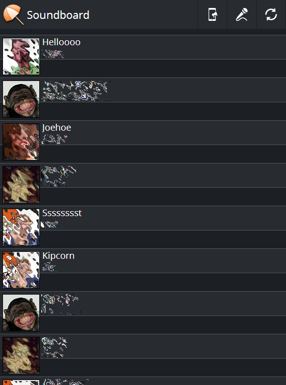

# Soundboard
by ltGuillaume: [Codeberg](https://codeberg.org/ltGuillaume) | [GitHub](https://github.com/ltGuillaume) | [Buy me a beer](https://buymeacoff.ee/ltGuillaume) 🍺

_Soundboard is a simple mobile web-based soundboard system with the ability to record your own sounds and play them on a remote (party) computer._

#### Included
- Soundboard web system (can be used as stand-alone system)
- Party client for Windows ([AutoIt](https://www.autoitscript.com/autoit3/) script + executable)
- Party client via local HTTP server
- Landing page to link to an online playlist, like [Festify](https://getfestify.com)

#### Requirements
1. Web hosting with PHP (local or remote host)  
_For central use on parties (optional):_
2. A Windows (party) PC for playback via the Windows client  

_-- or --_  

1. A Windows/Linux (party) PC with web server, accessible by the Soundboard web system on  
_Optionally:_  
2. A (party) PC running [Festify](https://getfestify.com)

#### Dependencies
- Both clients are made to use [MPV](https://mpv.io/).
- The Windows client is made with [AutoIt](https://www.autoitscript.com/autoit3/).
- For [Festify](https://getfestify.com), you'll need a [Spotify Premium](https://spotify.com) account.

#### Screenshots
###### Soundboard:  
