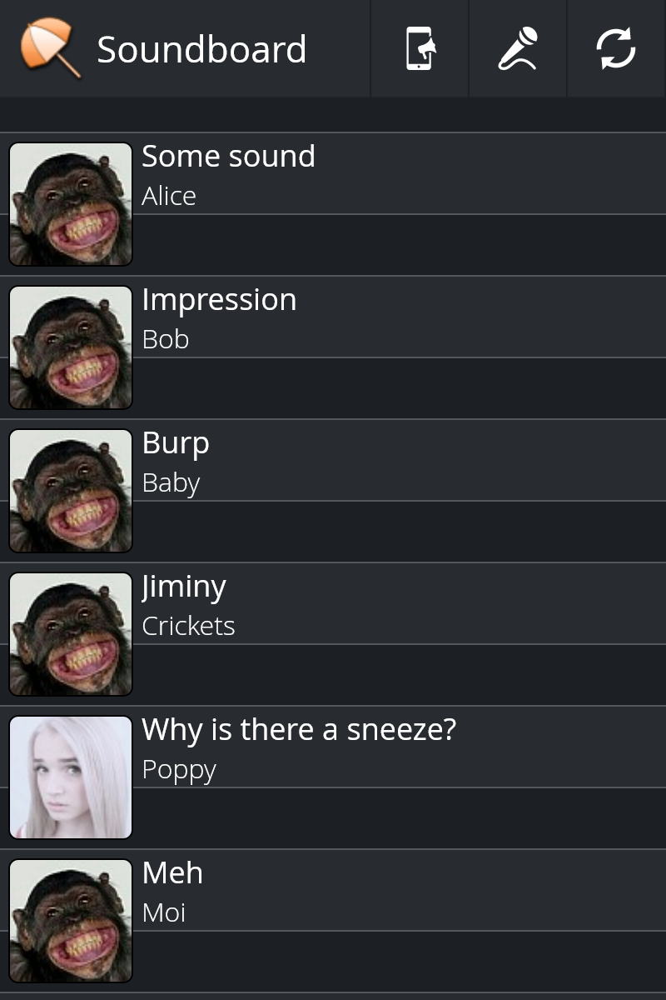

# Soundboard
by ltGuillaume: [Codeberg](https://codeberg.org/ltguillaume) | [GitHub](https://github.com/ltguillaume) | [Buy me a beer](https://coff.ee/ltguillaume) 🍺

_Soundboard is a simple mobile web-based soundboard system with the ability to record your own sounds and play them on a remote (party) computer._

#### Included
- Soundboard web system (can be used as stand-alone system)
- Admin mode to prevent new uploads, remove uploaded soundbites and set the link to the party playlist for the landing page:
	- Safari/iOS: scroll down to the "Manage sounds" button
	- Otherwise: right-click (long-press) the title bar
- The soundboard includes a remote playback client mode to receive playback commands from other users
- Landing page to link to an online playlist, such as [Festify](https://getfestify.com)

#### Installation
See [INSTALL.txt](INSTALL.txt) for instructions.

#### Dependencies
- For [Festify](https://getfestify.com), you'll need a [Spotify Premium](https://spotify.com) account.

#### Screenshot
